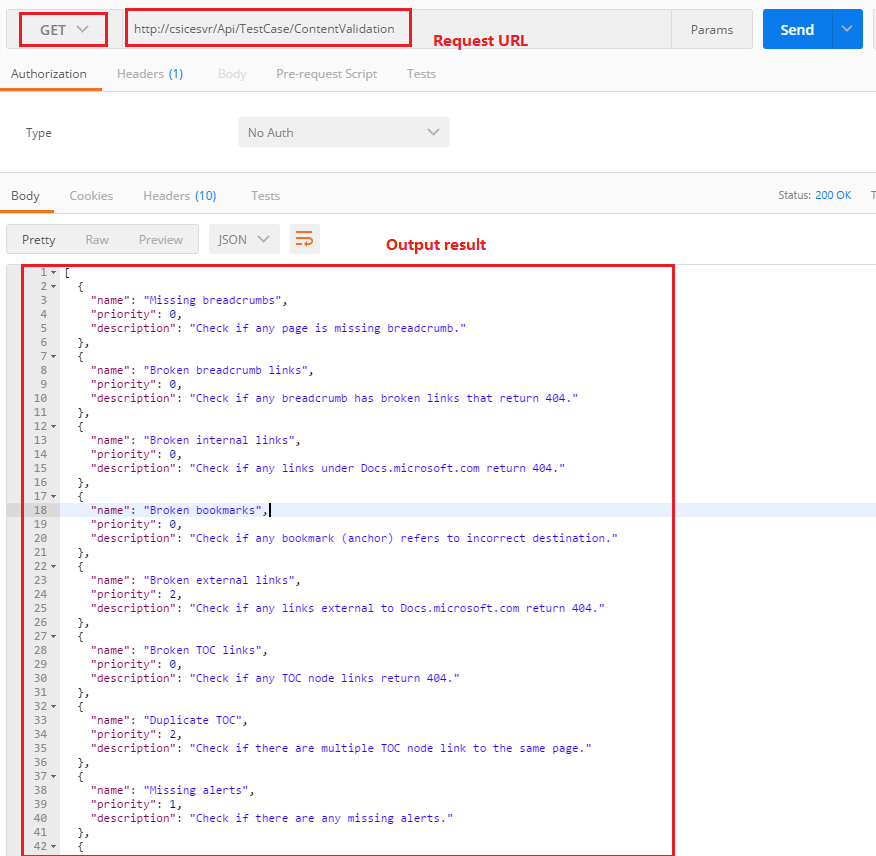

# CATS API for triggering run
In this article
* [Contacts](#contacts)
* [Overview](#overview)
* [Call CATS API via UI tool or code](#usage)

## <a id='contacts'></a> Contacts
|Role |Name; Alias|
|-----|-----|
|Program Manager|Ke Xu (kexu@microsoft.com)|
|Quality|cpebystest@microsoft.com;|

## <a id='overview'></a> Overview
### Goals
Triggering CATS run via call CATS API

### <a id='api'></a> API
* **Input parameters**: runname, createdBy, testCases and testUrls
* **Output**: RunId in CATS
* **Request URL**: http://csicesvr/Api/ContentValidation/CreateRun_ForOPS
* **HttpMethod**: Post

## <a id='usage'></a> Usage
### Via PostMan call CAPS API
#### Pre-requisites:
Get Postman installed
- If you have not add PostMan App to Chrome. You need to add it to Chrome first.  Step as below:
    1. Open PostMan website: https://www.getpostman.com/
    2. click "Chrome" button, then click "ADD TO CHROME" on the top right corner of pop window.
    3. Launch PostMan App. 
- If the PostMan App had added to Chrome, you just need to launch it. Below is the step.
    1. Launch Chrome, open a new tab
    2. Click the Chrome App icon on the TOP left corner, if there are no Chrome App icon, if not you need to enable it first. 
    3. Click PostMan, the PostMan App will be launched.


1. Launch [PostMan](https://www.getpostman.com/) from Chrome (Open blank page in chrome, click Apps in the upper left corner then click PostMan)

> [!Note] 
> Neet to call via chrome PostMan app. CATS API does not support call web service via Windows PostMan app, it will return 401.2 - Unauthorized error message

2. Enter request URL mentioned in [API](#api) part. Select *HttpMethod* as **Post**
3. Click **Body**, select **raw** and **JSON(application/json)**
4. In request body, input request body with **JSON** format. 
    Request body
        - runName: Required. Any name of you CATS run, not exceed X characters
		- createdBy: Required. Your alias, format: "{Domain}\\alias", it does not check the format of createdBy, but if it does not correct, After the CATS run is kick off, it could not filter the run which is created by yourself via check the "Only Show Runs Created By Me" on CATS.
		- testCases: Required. The CATS test cases. It support input one or more CATS test cases. You can get all the CATS cases list and priority on [Get CATS test case list](#get-cats-test-cases-list). 
		- testUrls: Required. The Urls you need to verify, it support input one or more test URLs. CATS will verify the each URL itself. 

    - Request body format
    <pre> 
    {
        "runName":"{your run name}",
        "createdBy":"{your alias}",
        "testCases": ["CATS test Case1", "CATS test Case2", …],
        "testUrls":["URL1", "URL2"]
    }
    </pre>
    - Request body example
    <pre>
    {
        "runName":"testOps",
        "createdBy":"FAREAST\\v-yulwa",
        "testCases": ["Missing breadcrumbs"],
        "testUrls":["https://docs.microsoft.com/en-us/", "https://docs.microsoft.com/en-us/windows/"]
    }
    </pre>

5. Click **Send**, the output is Runid in CATS, Go back to CATS, you could check results of this run
    

### <a id='get-cats-test-cases-list'></a> Get CATS test case list
1. Launch PostMan from Chrome
2. Enter request URL: http://csicesvr/Api/TestCase/ContentValidation 
3. Select **HttpMethod** as **Get**
4. Click **Send**, the output is the CATS test case list.
    

### Via Code call CAPS API
1. Get Test cases list. Sample code code would be as following:

    ```C#
    var client = new HttpClient(handler);
    client.BaseAddress = new Uri("http://csicesvr/");

    static string[] ListTestCases(HttpClient client)
        {
            var responseBody = client.GetStringAsync("/api/testcase/ContentValidation").GetAwaiter().GetResult();
            var testCases = JArray.Parse(responseBody).Select(x => x["name"].ToString()).ToArray();
            return testCases;
        }
    ```

2. Create CATS Run. Sample code would be as following:
    
    ```C#
    static string CreateRun(HttpClient client, string runName, string createBy, string[] testCases, string[] testUrls)
        {
            var response = client.PostAsJsonAsync("/Api/ContentValidation/CreateRun_ForOPS",
                new
                {
                    runName = runName,
                    createBy = createBy,
                    testCases = testCases,
                    testUrls = testUrls
                })
                .GetAwaiter().GetResult();

            var responseBody = response.Content.ReadAsStringAsync().GetAwaiter().GetResult();

            return JObject.Parse(responseBody)["runId"].ToString();
        }
    }
    ```

3. Completed Sample code:

    ```C#
    using System;
    using System.Collections.Generic;
    using System.Linq;
    using System.Text;
    using System.Threading.Tasks;
    using System.Net.Http;
    using Newtonsoft.Json.Linq;

    namespace CATSApiClientSample
    {
        class Program
        {
            static void Main(string[] args)
            {
                var handler = new HttpClientHandler();
                handler.UseDefaultCredentials = true;
                var client = new HttpClient(handler);
                client.BaseAddress = new Uri("http://csicesvr/");

                Console.WriteLine("All Test Cases:");
                foreach (var c in ListTestCases(client))
                    Console.WriteLine(c);

                Console.WriteLine();
                var runId = CreateRun(
                    client: client,
                    runName: "RunName",
                    createBy: "YourAlias",
                    testCases: new[] { "Broken TOC links", "Broken external links", "Broken internal links" },
                    testUrls: new[] { "https://docs.microsoft.com/" });

                Console.WriteLine($"Run [{runId}] created.");
                Console.ReadLine();
            }

            static string[] ListTestCases(HttpClient client)
            {
                var responseBody = client.GetStringAsync("/api/testcase/ContentValidation").GetAwaiter().GetResult();
                var testCases = JArray.Parse(responseBody).Select(x => x["name"].ToString()).ToArray();
                return testCases;
            }

            static string CreateRun(HttpClient client, string runName, string createBy, string[] testCases, string[] testUrls)
            {
                var response = client.PostAsJsonAsync("/Api/ContentValidation/CreateRun_ForOPS",
                    new
                    {
                        runName = runName,
                        createBy = createBy,
                        testCases = testCases,
                        testUrls = testUrls
                    })
                    .GetAwaiter().GetResult();

                var responseBody = response.Content.ReadAsStringAsync().GetAwaiter().GetResult();

                return JObject.Parse(responseBody)["runId"].ToString();
            }
        }
    }
    ```
