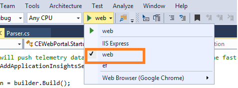

# How to deploy CATS debug machine
In this section:
* [Environment configuration](#environment-configuration)
* [Set-up test runner locally](#set-up-test-runner-locally)
* [Set up website locally](#set-up-website-locally)
## <a id='environment-configuration'></a>Environment Configuration:
### Step1: Get the latest code of **CATS**
Download/Sync the **CATS** repo to local
Code Branch:
- Stage/test environment: **CATS/Develop**
- Prod environment: **CATS/Prod**
### Step2: Build the Solution
Launch **VS** as administrator, open solution file **ContentAutomation.sln** locally under: "/CATS/ContentAutomation/". Build the solution, make sure project could be built successfully.
    
### Step3: Browser **Chrome** installed
Currently, **Chrome** is default browser for case execution
### Step4: Jave - 32bit installed
Download path: https://java.com/en/download/manual.jsp
> [!NOTE]
> It is required if you want to run **HTMLFormat** case
### Step5: Update DNX 
1. Open **%USERPROFILE%.dnx**(e.g. C:\Users\{your alias}\.dnx),delete following folders：
    * bin\packages
    * runtimes
2. Open cmd under **CEWebPortal** folder (e.g. {WorkDir}CATS\ContentAutomation\CEWebPortal), input command orderly:
    1. set DNX_UNSTABLE_FEED=https://www.myget.org/F/aspnetcidev
    2. dnvm upgrade
    3. dnvm upgrade -u (Optional, could skip)
    4. updating NuGet.Config (Optional, could skip)
    5. dnu restore (if failed try this: dnu restore –s https://api.nuget.org/v3/index.json)
3. Set **CEWebPortal** as startup project and Rebuild
4. Set startup type to **Web** 
    - 
5. Restart **VS** and **Solution**  
    
## <a id='set-up-test-runner-locally'></a>Set-up test runner locally
### Step1: Make sure you are connect to the correct DB server and database
Check connection in **App.config** under project **TestRunner**
```
<connectionStrings>
    <add name="ContentDataContext" connectionString="Data Source={database srever name};Initial Catalog={database name};Integrated Security=True;MultipleActiveResultSets=true" providerName="System.Data.SqlClient" />
</connectionStrings>
```
### Step2: Set **TestRunner** as StartUp Project
- Set **TestRunner** as startup project
- Press **F5** and start up, if there is any queueing run, it's start running 
## <a id='set-up-website-locally'></a>Set up website locally
### Step1: Make sure you are connect to the correct DB server and database
- Check connection in **Web.config** under project **CEWebPortal**
```
<connectionStrings>
    <add name="ContentDataContext" connectionString="Data Source={database srever name};Initial Catalog={database name};Integrated Security=True;MultipleActiveResultSets=true" providerName="System.Data.SqlClient" />
</connectionStrings>
```
### Step2: Set "CEWebPortal" as StartUp Project
- Right-click **CEWebPortal** and click **Set as StartUp Project** on pop uo right click menu
### Step3: Start
 - Click **Web** to start the project
 - Open browser and input URL: http://localhost:5000