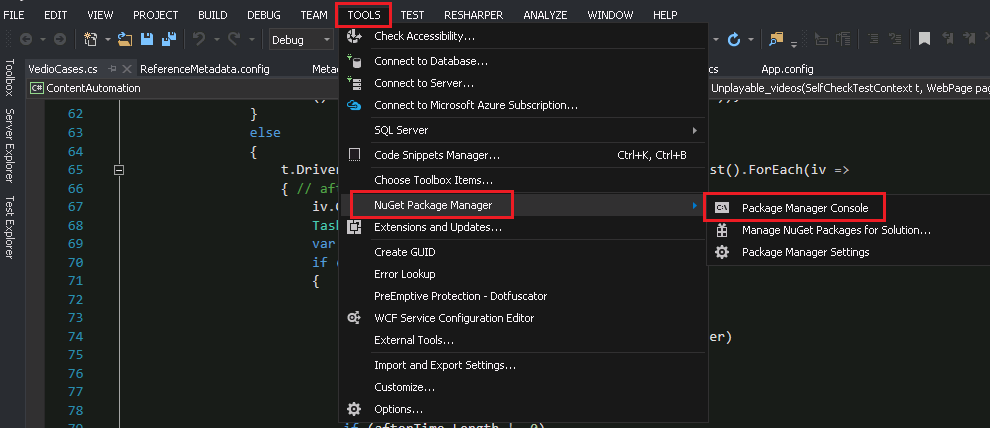
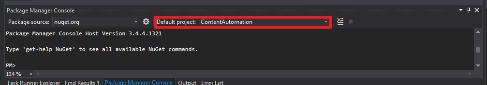

# How to deploy CATS DB
**CATS** is using **Entity Framework** as **ORM library**, which makes it easy to create a database schema locally.

### Step1-2: Get the latest code of CATS
Firstly, we need to finish **Step1** and **Step2** in [Environment configuration](How-to-deploy-CATS-debug-machine.md#environment-configuration).
	
### Step 3: Set startup project
Set the project **TestRunner** as startup project.

[!NOTE] This step is optional, but just remember connection string in config file of startup project should be set properly as following steps, since Entity Framework database migration tool will use it to connect your local database.
	
### Step 4: Set the connection string on configuration file
Set the connection string in **TestRunner** project to target your local database.
- Connection string can be found in **App.config**, through path: **configuration** -> **connectionStrings** -> **add**. 
- Connection string should be:
    - Syntax: Data Source={database srever name};Initial Catalog={database name};Integrated Security=True;MultipleActiveResultSets=true'.
    - e.g. Data Source=csicedbsvr;Initial Catalog=CATS_Prod;Integrated Security=True;MultipleActiveResultSets=true
    - Refer to:  Connection String Building Reference
	
### Step 5: Generate DB on Package Manager Console window
1. Switch to 'Package Manager Console' window.
If it isn't on your screen, you can find it from 'Tool -> NuGet package manage -> Package Manager Console'.

	
2. Select project 'ContentAutomation' in 'Default project' drop down box of 'Package Manager Console' window.

	
3. Input 'Update-Database' in  'Package Manager Console' window, and press 'Enter' to create your local database.
	
### Step6: Add the test machine name into Machine table of DataBase
Code sample for insert Machine name into Database table
```
Insert into Machines(MachineId,MachineName,TimeStamp,Status) values('20170220','MachineName','2017-04-14 10:26:58.673','0')
```
