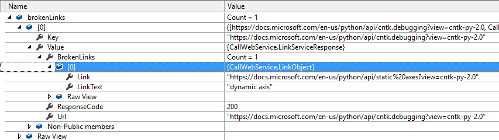

# CATS Web Service for broken links check
In this article
* [Contacts](#contacts)
* [Overview](#overview)
* [Functional Requirements](#requirement)
* [Call Web Service via UI tool or code](#usage)

## <a id='contacts'></a> Contacts
|Role|Name; Alias|
|-----|----------|
|Program Manager|Ke Xu (kexu@microsoft.com)|
|Developer|Bin Zhou (v-bzho@microsoft.com)|
|Quality|cpebystest@microsoft.com;<br>Kalyan C Kesireddy(kalyanke@microsoft.com)|

## <a id='overview'></a>Overview
### Goals

* To enable CATS and SkyEye get broken links with input url list
* Provide high accuracy rate and performance

### Dependencies and Risks
* The input urls count of this web service is limited to 1000
* The performance of the web service is depend on network and host machine performance

## <a id='requirement'></a> Functional Requirements
List the requirements that the web service should satisfy in order of priority:
|Must-Have Requirements (P1)|Desired Requirements (P2 – P3)|
|--------|-----------|
|Ability to handle any exception|Able to export outputs to a local file or database|
|Ability to output accurate broken links|Host on Azure web service|
|Ability to provide high performance||

## <a id='usage'></a> Usage
### <a id='host'></a> Host
* The web service host URL is http://10.213.224.35/, 
* Access url is: http://10.213.224.35/api/link/getbrokenlink

### Call
User could call the web service either via UI tool or via code

#### Via UI Tool, recommended tool is Chrome [PostMan](https://www.getpostman.com/), it’s a Chrome app that operation easily
1. Launch **PostMan** from Chrome (Open blank page in chrome, click Apps in the upper left corner then click PostMan)
2. Entry access url mentioned in [Host](#host) part. Select *HttpMethod* as **Post**
3. Click Body, select **raw** and **JSON(application/json)**
4. In request body, input url list with **JSON** format. The input urls count is limited to 1000
Request header：
    - **Method**: Post
    - **Request URL**: {Host}/api/link/getbrokenlink  e.g. http://10.213.224.35/api/link/getbrokenlink
    - **Body**:
        - Option: raw, Json 
        - Content: 
            - ["Single URL"]
            - ["URL1", "URL2","URL3"]   
5. Click **Send** to get output broken links

6. View Result
    In response body, select Json format.
    - **Url**: the input URL        
    - **BrokenLinks**: 
        * The webservice will get urls in main body. 
        * If there is Broken Link in request test pages, it would report the link and link text, or the value is null.
        * If there is one link with multiple link text, it will report all.
        * If there are multiple link and link text is the same, will report one and skip the rest.
        * It would skip example link. (exclude example links by keywords and [example link writelist](https://review.docs.microsoft.com/en-us/help/onboard/example-link-white-list)
    - **ResponseCode**: The response status of URL request.
        - **200**: Success
        - **1000**: Can't get http response
        - **1001**: Can get http response, but IsSuccessStatusCode of http response is falseCan get http response, but IsSuccessStatusCode of http response is false
        - **1002**: Input url is not a validate http url
        - **1003**: Internal docs url and need user to login

        You can call the API via httpget method with no input parameter to check the definitions of response code 

    |Field	|Value|
    |------|-------|
	|Method|get|
	|Request URL	|{Host}/api/link/getresponsecode <br>e.g. http://10.213.224.35/api/link/getresponsecode |

    

#### Via code
1. Define a class named LinkServiceResponse which contains Url (type is string), BrokenLinks (type is List<LinkObject>, broken link collection) and ResponseCode(type is int, different response code represents different result, defined in #2)

    ```C#
    public class LinkServiceResponse
    {
        public string Url { get; set; }
        public List<LinkObject> BrokenLinks { get; set; } = new List<LinkObject>();
        public int ResponseCode { get; set; }
    }
    ```

    Definition of LinkObject:

    ```C#
    public class LinkObject
    {
        public string Link { get; set; }
        public string LinkText { get; set; }
    }
    ```
2. Define a method to send httprequest with request url is http://10.213.224.35/, accepted header should be `application/json`. Sample code would be as following:

    ```C#
    public static async Task<ConcurrentDictionary<string, LinkServiceResponse>> GetBrokenLinks(IList<string> inputUrls, string requestUrl)
    {
        var result = new ConcurrentDictionary<string, LinkServiceResponse>();
        Httpclient.BaseAddress = new Uri(requestUrl);
        Httpclient.DefaultRequestHeaders.Accept.Clear();
        Httpclient.DefaultRequestHeaders.Accept.Add(new MediaTypeWithQualityHeaderValue("application/json"));
         
        var content = new StringContent(JsonConvert.SerializeObject(inputUrls), Encoding.UTF8, "application/json");
        // HTTP POST
        HttpResponseMessage response = await Httpclient.PostAsync("api/link/getbrokenlink", content);
        if (response.IsSuccessStatusCode)
        {
        string data = await response.Content.ReadAsStringAsync();
        result = JsonConvert.DeserializeObject<ConcurrentDictionary<string, LinkServiceResponse>>(data);
        }
            return result;
    }
    ```

3. Specific input urls and get broken links
    Sample code would be as following:

    ```C#
    var requestUrl = "http://10.213.224.35/";
    var inputUrlList = new List<string>
    {
        "https://docs.microsoft.com/en-us/python/api/cntk.debugging?view=cntk-py-2.0",
    };
     
    var brokenLinks = GetBrokenLinks(inputUrlList, requestUrl).GetAwaiter().GetResult();
    ```

4. Verify output result
    Output result would be as following:
    
5. Completed Sample code:

    ```C#
    using Newtonsoft.Json;
    using Newtonsoft.Json.Serialization;
    using System;
    using System.Collections.Concurrent;
    using System.Collections.Generic;
    using System.IO;
    using System.Linq;
    using System.Net;
    using System.Net.Http;
    using System.Net.Http.Headers;
    using System.Reflection;
    using System.Text;
    using System.Threading.Tasks;
     
    namespace CallWebService
    {
        class Program
        {
            public static readonly HttpClient Httpclient = new HttpClient();
                
            static void Main(string[] args)
            {
                var requestUrl = "http://10.213.224.35/";
                var inputUrlList = new List<string>
                {
                    "https://docs.microsoft.com/en-us/python/api/cntk.debugging?view=cntk-py-2.0",
                };
     
                var brokenLinks = GetBrokenLinks(inputUrlList, requestUrl).GetAwaiter().GetResult();
     
                Console.ReadKey();
            }
     
            public static async Task<ConcurrentDictionary<string, LinkServiceResponse>> GetBrokenLinks(IList<string> inputUrls, string requestUrl)
            {
                var result = new ConcurrentDictionary<string, LinkServiceResponse>();
                Httpclient.BaseAddress = new Uri(requestUrl);
                Httpclient.DefaultRequestHeaders.Accept.Clear();
                Httpclient.DefaultRequestHeaders.Accept.Add(new MediaTypeWithQualityHeaderValue("application/json"));
     
                var content = new StringContent(JsonConvert.SerializeObject(inputUrls), Encoding.UTF8, "application/json");
                // HTTP POST
                HttpResponseMessage response = await Httpclient.PostAsync("api/link/getbrokenlink", content);
     
                if (response.IsSuccessStatusCode)
                {
                    string data = await response.Content.ReadAsStringAsync();
                    result = JsonConvert.DeserializeObject<ConcurrentDictionary<string, LinkServiceResponse>>(data);
                }
                return result;
            }
        }
     
        public class LinkServiceResponse
        {
            public string Url { get; set; }
            public List<LinkObject> BrokenLinks { get; set; } = new List<LinkObject>();
            public int ResponseCode { get; set; }
        }
     
        public class LinkObject
        {
            public string Link { get; set; }
            public string LinkText { get; set; }
        }
    }
    ```


    


