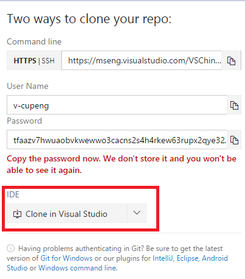

# How to config a debug machine

Before you validate docs template on your local , you need to set up a development environment. This page will tell you some tips for setting up the development environment and the steps of how to config a debug machine.

## Tools need to install
* Java: [https://java.com/en/download/manual.jsp](https://java.com/en/download/manual.jsp)
* Git: [http://git-scm.com/download/](http://git-scm.com/download/)
* Nodejs: [https://nodejs.org/en/](https://nodejs.org/en/)
* Python: [https://www.python.org/downloads/](https://www.python.org/downloads/)

> [!TIP]
> When install git, Need to choose use git command via windows command

## Download code
You need to download latest version code form site.

### Download code from remote
1. Open site of contain code source
2. Click 'Clone' link at top-right
3. Clone in Visual Studio

5. Visual Studio will execute and select proper folder and download to local

### Get latest version code from git
1. Open cmd command under (E:\TFS_git_workspace\Docs.E2E\test\Docs) code path in PC

> [!TIP]
> If your git command is setted as used in windows cmd windows

2. Command 'git checkout (-b) master' (switch to master branch)
3. Command 'git pull  master'  (get latest version of code) 

### Npm install
1. Open cmd under (E:\TFS_git_workspace\Docs.E2E)
2. Run : Npm install
3. Run: Npm install -g protractor

## How to run test case at local
1. Open a cmd windows under docs(Example path:E:\TFS_git_workspace\Docs.E2E\test\Docs)
2. Run: Webdriver-manager update(optional)
3. Run: Webdriver-manager start

> [!TIP]
> If start failed, may be problem of nodejs version, may be need to uninstall it and re install it

4. Open a new cmd windows from TC path(Example path: E:\TFS_git_workspace\Docs.E2E\test\Docs)
5. Run command: example: 			
protractor protractor.config.js --cpapabilities.maxInstances=1 --baseUrl=https://docs.microsoft.com --suite=toc
